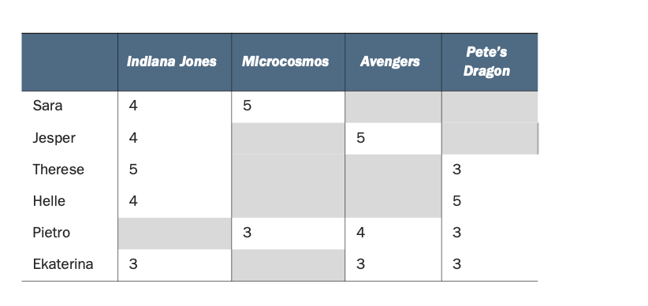
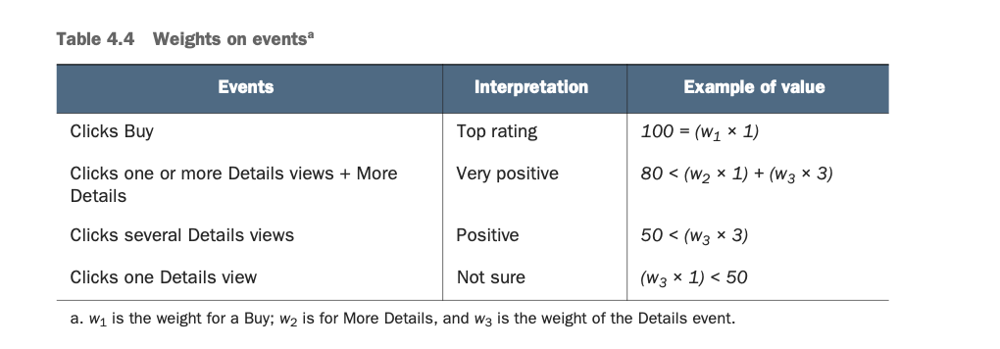

# Chapter 4. Ratings and how to calculate them

- Creating user-item matrices.
- Revisiting explicit ratings to discover why they aren’t always good.
- Diving into the mystery of implicit ratings and its creation.
- Learning about an implicit ratings function that translates evidence
into ratings.

### User-Item matrix

### Explicit ratings vs Implicit ratings
Explicit
- 직접적인 피드백들
Implicit
- 클릭수
- 살펴보기

### Implicit Rating
IRi,u = w1  #event1 + w2  #event2 + ... + wn  #eventn

가중치 값을 설정하는 것은 ML 문제로 해석할 수 있다.
(You’ll want to predict an implicit rating based on various events. )

### How to implement implicit ratings
- Retrieving data
- Calculating ratings
- Viewing and understanding